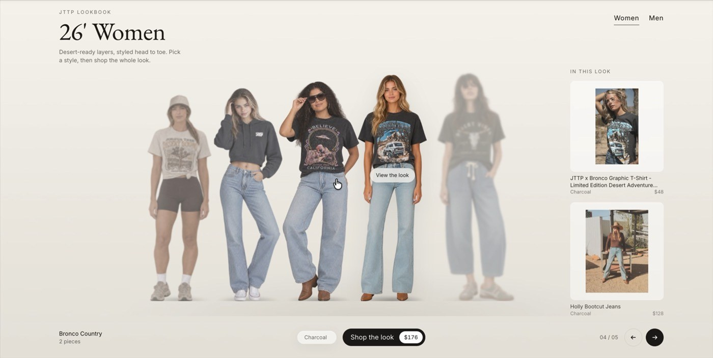

# Lookbook Lineup: a "shop the look" section for Shopify

[](media/demo.mp4)

▶ **[Watch the demo (MP4, 30 s)](media/demo.mp4)**. The section running on a live store: moving through the lineup, swapping colourways, the shop-the-look detail sheet and the Women/Men tabs.

A Shopify theme section that shows outfits as a lineup of full-body models:

- The current look stands tall on the right, earlier looks recede and fade to the left, and the next look waits as a soft ghost. Use the arrows, swipe, ←/→ keys or click a figure to move along the row.
- Group tabs (e.g. **Women / Men**) are created from each look's group.
- **Colour swatches** swap the model photo, and every piece switches to its matching colour variant.
- **Shop the look** shows the total price, and an **In this look** rail lists the products.
- A **detail sheet** lets shoppers tick pieces, pick sizes and add the whole look to the cart in one `/cart/add.js` call. It opens a Dawn-style cart drawer if the theme has one, otherwise it shows a "View bag" link.

Looks are managed in **Shopify admin → Content → Metaobjects**, as normal forms with image upload and product pickers. You don't need the theme editor or any code to add, swap or hide looks.

No app, no external scripts, one Liquid file. Theme Check clean (only the Google Fonts warning).

## Repo

| Path | What |
| --- | --- |
| `sections/lookbook-lineup.liquid` | The section (markup, CSS, JS, schema). The only file the theme needs. |
| `setup/1-colourway-definition.graphql` | Creates the **Lookbook Colourway** content type |
| `setup/2-look-definition.graphql` | Creates the **Lookbook Look** content type |
| `setup/3-example-look.graphql` | Optional: creating a look by API |
| `tools/process_models.py` | Lines up model photos (trim, shoes on the floor line, 800×2000 WebP) |
| `preview/build.js` | Local preview with placeholder figures: `node preview/build.js`, then open `preview/index.html` |

## Install

### 1. Create the content types (once per store)

Run the two setup mutations in order, in the [Shopify GraphiQL App](https://shopify-graphiql-app.shopifycloud.com/) (Admin API) or any Admin API client with `write_metaobject_definitions`:

1. `setup/1-colourway-definition.graphql`. Copy the `id` it returns.
2. `setup/2-look-definition.graphql`. First replace `COLOURWAY_DEFINITION_ID` with that id.

You'll then have **Content → Metaobjects → Lookbook Look** and **Lookbook Colourway**. Both are readable on the storefront, and looks have an Active/Draft status.

### 2. Add the section to your theme

Work on a duplicate theme first.

```bash
shopify theme push --store YOUR-STORE.myshopify.com --theme THEME_ID --only sections/lookbook-lineup.liquid --path .
```

Or in **Online Store → Themes → Edit code → sections → Add a new section** named `lookbook-lineup`, then paste the file in.

Then in **Customize**, use **Add section → Lookbook lineup**.

### 3. Add looks

1. **Content → Files:** upload a full-body model photo for each colourway (see *Model photos* below).
2. **Content → Metaobjects → Lookbook Colourway:** add an entry for each colour of a look. Fill in the colour name, swatch and model image.
3. **Content → Metaobjects → Lookbook Look:** fill in the name, group (tab), sort order, story, 1–4 products and 1–3 colourways. Set it to **Active**.

## Which looks appear

- **No blocks in the section:** every Active look, sorted by *Sort order*. New looks appear automatically.
- **With blocks:** exactly the blocks in the theme-editor sidebar, in that order. Use this to hand-pick looks for a particular page.
  - **Look from admin** picks a Lookbook Look.
  - **Custom look** is filled in directly in the block.
  - A look picked twice only shows once.

## Colourways and variants

Name a colourway exactly like the product's colour option value (e.g. `Olive`). Swatches then switch the variant that goes into the cart and the size availability shown. If no variant matches, the first available one is used. Sizes come from the option named *Size* (or *Shoe size*).

## Model photos

Each colourway needs one full-body cut-out:

- **Format:** transparent PNG or WebP, the person centred, feet touching the bottom edge.
- **Consistency:** same camera height and light for every look. The lineup only reads right at a consistent scale.
- **Batch tidy-up:** `python3 tools/process_models.py IN_DIR OUT_DIR` (needs Pillow) trims each image, normalises the height and outputs 800×2000 WebP ready to upload.

## Section settings

Heading, eyebrow, subheading, tab order, rail and button labels, an optional secondary button, lineup height, figure width, colours and spacing. *Bottom padding* defaults to 0 so the bottom bar sits evenly spaced.
